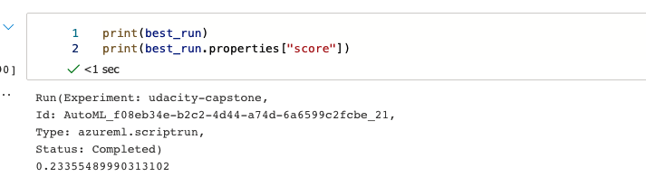
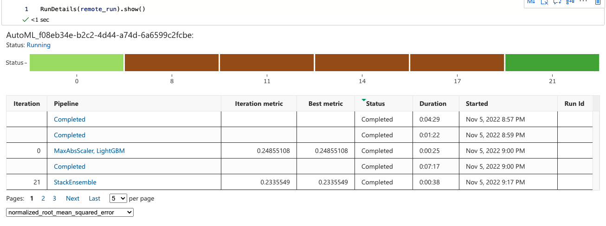
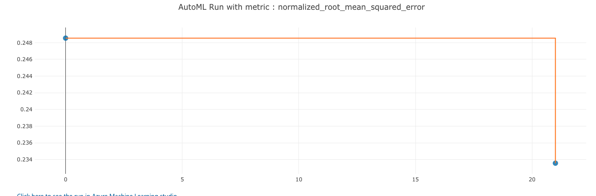
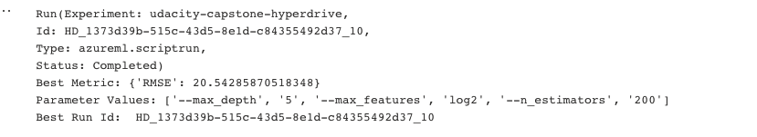
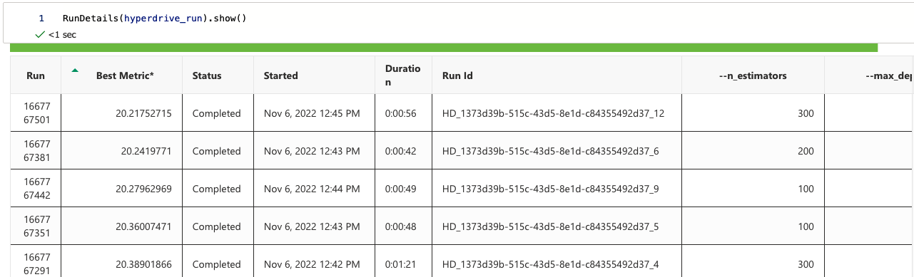
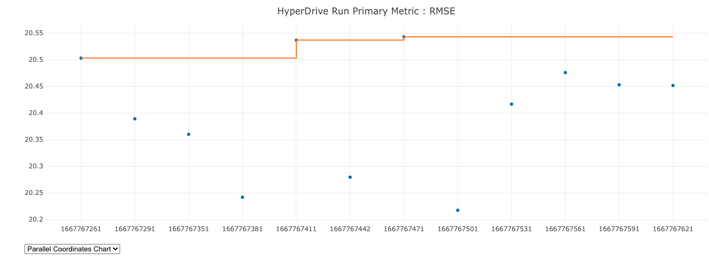
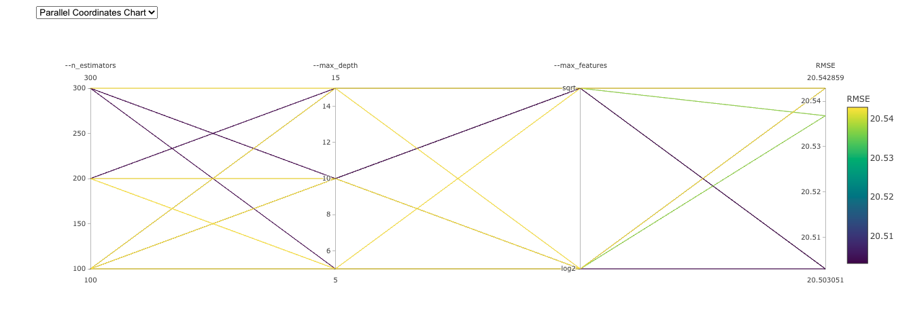

# Udacity Azure ML Capstone

This project is intended to test our knowledge on the content learned in the azure ML course from udacity. Using a dataset of our choice,  in this project we will create two models: one using Automated ML (denoted as AutoML from now on) and one customized model whose hyper parameters are tuned using HyperDrive. We will then compare the performance of both the models and deploy the best performing model. This project will bring together everything we have learned in the course thus far, it is the final project. By the end, we will have demonstrated our ability to use an external dataset in a workspace, train a model using the different tools available in the AzureML framework as well as the ability to deploy the model as a web service.

## Project Set Up and Installation
*OPTIONAL:* If your project has any special installation steps, this is where you should put it. To turn this project into a professional portfolio project, you are encouraged to explain how to set up this project in AzureML.

## Dataset

### Overview
The dataset I will be using in this project is the Top Hits Spotify from 2000-2019 dataset retrieved from kaggle
It contains audio statistics of the top 2000 tracks on Spotify from 2000-2019, measured by 18 columns each describing the track and it's qualities.
I chose this dataset because I am a big fan of the spotify platform and music in general. Predicting song popularity seems like
a difficult task, if it were easy then everyone could make one hit wonders!

### Task
As mentioned above, the goal of this project will be to predict the popularity value of a song. Popularity is measured
on a continuous scale, the higher the number the more popular the song is. In order to complete this task, we will be using 
audio statistics for each song in the dataset. More details can be found below:

- artist: Name of the Artist.
- song: Name of the Track.
- duration_ms: Duration of the track in milliseconds.
- explicit: The lyrics or content of a song or a music video contain one or more of the criteria which could be considered offensive or unsuitable for children.
- year: Release Year of the track.
- popularity: The higher the value the more popular the song is.
- danceability: Danceability describes how suitable a track is for dancing based on a combination of musical elements including tempo, rhythm stability, beat strength, and overall regularity. A value of 0.0 is least danceable and 1.0 is most danceable.
- energy: Energy is a measure from 0.0 to 1.0 and represents a perceptual measure of intensity and activity.
- key: The key the track is in. Integers map to pitches using standard Pitch Class notation. E.g. 0 = C, 1 = C♯/D♭, 2 = D, and so on. If no key was detected, the value is -1.
- loudness: The overall loudness of a track in decibels (dB). Loudness values are averaged across the entire track and are useful for comparing relative loudness of tracks. Loudness is the quality of a sound that is the primary psychological correlate of physical strength (amplitude). Values typically range between -60 and 0 db.
- mode: Mode indicates the modality (major or minor) of a track, the type of scale from which its melodic content is derived. Major is represented by 1 and minor is 0.
- speechiness: Speechiness detects the presence of spoken words in a track. The more exclusively speech-like the recording (e.g. talk show, audio book, poetry), the closer to 1.0 the attribute value. Values above 0.66 describe tracks that are probably made entirely of spoken words. Values between 0.33 and 0.66 describe tracks that may contain both music and speech, either in sections or layered, including such cases as rap music. Values below 0.33 most likely represent music and other non-speech-like tracks.
- acousticness: A confidence measure from 0.0 to 1.0 of whether the track is acoustic. 1.0 represents high confidence the track is acoustic.
- instrumentalness: Predicts whether a track contains no vocals. "Ooh" and "aah" sounds are treated as instrumental in this context. Rap or spoken word tracks are clearly "vocal". The closer the instrumentalness value is to 1.0, the greater likelihood the track contains no vocal content. Values above 0.5 are intended to represent instrumental tracks, but confidence is higher as the value approaches 1.0.
- liveness: Detects the presence of an audience in the recording. Higher liveness values represent an increased probability that the track was performed live. A value above 0.8 provides strong likelihood that the track is live.
- valence: A measure from 0.0 to 1.0 describing the musical positiveness conveyed by a track. Tracks with high valence sound more positive (e.g. happy, cheerful, euphoric), while tracks with low valence sound more negative (e.g. sad, depressed, angry).
- tempo: The overall estimated tempo of a track in beats per minute (BPM). In musical terminology, tempo is the speed or pace of a given piece and derives directly from the average beat duration.
- genre: Genre of the track.

### Access
In order to access the data in my workspace, I first downloaded the data from kaggle. After this, I uploaded the raw csv 
file to my github repository. I will use this link and the Tabular dataset library in azure to download the data
and create a data asset in Azure. This process is outlined below

```
found = False
key = "spotify-songs-dataset"
description_text = "Top Hits Spotify from 2000-2019"

if key in ws.datasets.keys(): 
        found = True
        dataset = ws.datasets[key] 

if not found:
        # Create AML Dataset and register it into Workspace
        data = 'https://raw.githubusercontent.com/ash-mohan/azureMLCapstone/main/starter_file/data/songs_normalize.csv'
        dataset = Dataset.Tabular.from_delimited_files(data)        
        #Register Dataset in Workspace
        dataset = dataset.register(workspace=ws,
                                   name=key,
                                   description=description_text)
```

## Automated ML
The primary metric I chose for this experiment is Root Mean Squared Error (RMSE). MSE is typically the most common metric 
for regression tasks is MSE. It is the average of the squared difference between the predicted and actual value. MSE is differentiable and has a convex shape, therefore 
it is easier to optimize. RMSE is the square root of the average of the squared difference of the predicted and actual value. One benefit of RMSE is that it penalizes large errors.

In order to ensure a reasonable training time, I set experiment timeout to 15 minutes. The dataset I am using is relatively small, 
so longer training times may not give better results. Additonally, I set the maximum current iterations to 5 to take advantage of the 
hardware and stay within the 15 minute bound. Early stopping is also enabled to make the training process much more efficient. 
Given the small size of my dataset, I chose a larger value for cross validations to ensure the best possible results. 
Featurization is set to auto to take advantage of auto ML capabilities.

### Results
The results of the best model produced by auto ML can be seen below



I think one of the biggest improvements would be to take full advantage of the text columns in this dataset. There are a lot better 
methods for featurization of text data that we could use, as well as better NLP models. Some that come to mind are word vectorization and 
sentiment creation. Additionally, gathering more data is a must. 2000 examples is not enough to create a generalizable model. 

Output from the Run Details widget can be seen here:




## Hyperparameter Tuning
For the hyperdrive experiment I chose to use a Random Forest Regressor. I chose to use this model because ensemble learning methods leverage multiple learners and can lead to better results. 
For the hyperparameter selection I chose to test different values for the number of estimators, depth of each tree, and the
maximum number of features. I chose larger values for the number of estimators to take advantage of the benefits of ensemble learning. 
For the depth, I did not want to choose too large of a value as this could worsen performance. The feature set is very large given the
encoding of the artist and genre columns, so I wanted to experiment with different values for maximum features. 
Using all of them could be overkill as the data is very sparse.
I chose to use the BanditPolicy for early termination. Based on the provided slack criteria, runs that don't fall within this criteria will be terminated. Using this policy will allow us to focus on the best performing runs, and eliminate those that would report poorly if they were allowed to complete.

For other configs, I set the maximum number of runs to 20 to avoid longer training times.

### Results
The best results from the hyperdrive model are below:


To improve performance, I could increase the maximum number of runs and perform better feature engineering. I could use tf-idf or bag of words
on the artist or song columns to create more features. 

Run Details output is below




## Model Deployment
The best model ended up being the one returned by autoML. It would seem that the feature engineering performed by autoML
may have been better than the manual feature engineering that I had performed. This can definitely be improved in future
iterations.

To deploy the model, I used Azures aci web service class. First we need to register the model, then define our deployment 
configuration. Here we can specify things like cpu_cores, memory, etc. My model is relatively small and does not need a lot 
of processing power, so I only used 1 core and 2 GB of memory. For larger models, especially deep learning ones, you would need
to modify these values. Additionally, we will have to save the environment that we will use on the container where our service 
is deployed and an inference config that references a script which will consume the model. This process is outlined below:

```
# Save the best model
best_model = remote_run.register_model(model_name='spotify-popularity-model')

aciconfig = AciWebservice.deploy_configuration(
    cpu_cores=1,
    memory_gb=2,
    description="Get popularity score for spotify song",
)

# save the environment
myenv = Environment.get(workspace=ws, name="AzureML-AutoML")
myenv.save_to_directory('env', overwrite=True)

inference_config = InferenceConfig(entry_script="score.py", environment=myenv)

# Use configs and models generated above
service=Model.deploy(workspace=ws,
                    name="modelwebservice",
                    models=[best_model],
                    inference_config=inference_config,
                    deployment_config=aciconfig)
service.wait_for_deployment(show_output=True)
```

After deploying our model there are multiple ways to test the endpoint. First we want to make sure that our endpoint is 
healthy. If it is not, we will not be able to reach it. Once we have verified this, we can take an entry from our testing 
data that we saved earlier and use the service object to make a request. See below:

```
if service.state == "Healthy":
    X_test = test_data.drop("popularity", axis=1)
    # Serialize the first row of the test data into json
    X_test_json = X_test[:1].to_json(orient="records")
    print(f"Data: {X_test_json}")
    # Call the service to get the predictions and the engineered and raw explanations
    output = service.run(X_test_json)
    # Print the predicted value
    print(f"\nPrediction: {output['predictions']}")
```

It is also extremeley important to remember to cleanup resources, otherwise we can incur high costs. This can be done as follows:

```
service.delete()
compute_target.delete()
```

All of these steps are outlined in the attached notebooks. 

## Screen Recording

The following [link](https://youtu.be/mUCsfoRIG_Q) will demonstrate:
- A working model
- Demo of the deployed  model
- Demo of a sample request sent to the endpoint and its response

## Standout Suggestions
*TODO (Optional):* This is where you can provide information about any standout suggestions that you have attempted.
